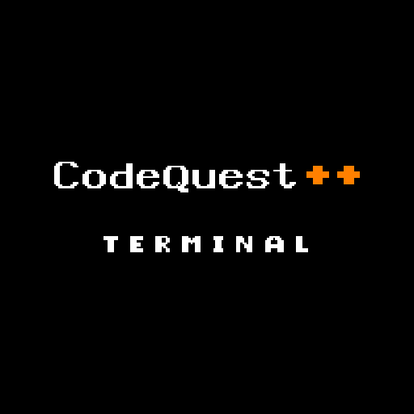

<p align="center">
  
</p>

<p align="center">
  <strong>Tactical RPG and 3D Raycaster rendering engine built purely in the terminal using C++23.</strong>
</p>

<p align="center">
  <a href="https://isocpp.org/"></a>
  <a href="https://cmake.org/"></a>
  <a href="https://learn.microsoft.com/windows/console/"></a>
  <a href="LICENSE"></a>
  
</p>

---

<p align="center">
  <strong>Idiomas / Languages:</strong><br>
  <a href="README.md"><strong>Português</strong></a> &nbsp;|&nbsp; <a href="README_EN.md"><strong>English (Current)</strong></a>
</p>

---

## Table of Contents

- [Overview](#overview)
- [Key Features](#key-features)
- [Project Architecture](#project-architecture)
- [Classes, Races, and Systems](#classes-races-and-systems)
- [Game Controls](#game-controls)
- [Building and Running](#building-and-running)
  - [Prerequisites](#prerequisites)
  - [Quick Scripts (Recommended)](#quick-scripts-recommended)
  - [Manual Compilation via CMake](#manual-compilation-via-cmake)
  - [Running the Game](#running-the-game)
- [Rendering Perspectives](#rendering-perspectives)
- [Engineering Retrospective (Post-Mortem)](#engineering-retrospective-post-mortem)
- [Documentation & Roadmap](#documentation--roadmap)
- [License](#license)

---

## Overview

**CodeQuestPlusPlus-Terminal** is an RPG game and pseudo-3D rendering engine built entirely from scratch in **pure C++23**, running completely inside the Windows text console (Win32 Console API).

The project was conceived as an in-depth computer science and software architecture study in modern object-oriented programming (OOP), design patterns (*State Pattern*, *Factory*, *Dependency Injection*, *Screen Registry*), and low-level computer graphics — rendering a real-time Raycaster environment without relying on third-party game engines (Unity, Unreal) or hardware-accelerated graphics libraries (OpenGL, DirectX, SDL).

---

## Key Features

- **3D Raycaster Console Engine**: Real-time projection and rasterization of walls, doors, and distance-based lighting calculated on CPU and translated directly to ANSI/Win32 character buffers.
- **Turn-Based Tactical Combat**:
  - Dynamic **Parry** mechanism with reactive timing.
  - Class-exclusive active skills, elemental spells, and combat consumables.
  - Monster AI with loot tables, damage calculations, and resistance modifiers.
- **Complete RPG Systems**:
  - **4 Playable Classes**: Archer, Bard, Mage, Warrior.
  - **4 Races with Unique Passives**: Dwarf, Elf, Human, Orc.
  - Interactive inventory, equipment slots (armor, helmets, shields, weapons).
  - Live Bestiary cataloging encountered monsters and real-time Quest Diary.
- **Multi-Map World**:
  - Starter Village with interactive NPCs (Blacksmith, Food Merchant, Combat Trainer).
  - Forest featuring labyrinth mazes, hidden treasure chests, and dark caves.
  - Kingdom Bridge and Royal Castle with guards and story encounters.
- **Hybrid Input (Keyboard + Mouse)**:
  - Responsive keyboard movement and full mouse-click support inside console menus via native Win32 input event polling.

---

## Project Architecture

The codebase enforces strict separation of concerns into modular layers:

```
CodeQuestPlusPlus-Terminal/
├── CMakeLists.txt              # Root CMake configuration
├── assets/                     # Visual assets and resource metadata
│   ├── icon.png                # High-resolution application icon (PNG)
│   ├── icon.ico                # Multi-resolution application icon
│   └── icon.rc                 # Win32 resource definition script
├── bin/                        # Output folder for compiled binaries
│   └── CodeQuestPlusPlus-Terminal.exe
├── cmake/                      # Modular CMake build scripts
│   └── CMakeLists.txt
├── docs/                       # Additional documentation
│   └── BUGS_E_FUTURO.md        # Technical debt and future considerations
├── scripts/                    # Windows build automation batch scripts
│   ├── compile_start.bat       # Clean build from scratch (EN)
│   ├── compile_changes.bat     # Fast incremental build (EN)
│   ├── compilar_inicio.bat     # Clean build from scratch (PT)
│   └── compilar_mudancas.bat   # Fast incremental build (PT)
└── src/                        # Main C++23 source code
    ├── Main.cpp                # Program entry point and UAC elevation
    ├── Core/                   # Core engine, timers, console abstraction
    │   ├── Engine/             # Game loop and state manager (StateManager)
    │   ├── Terminal/           # Color palettes, animations, and screen buffers
    │   └── Utils/              # Input dispatcher and helper utilities
    ├── Domain/                 # Domain entities and core game rules
    │   ├── Characters/         # Classes, races, and player stats
    │   ├── Items/              # Item factory, equipment, consumables
    │   └── NPCs/               # NPC dialogue logic and interaction handlers
    ├── Systems/                # Game mechanics subsystems
    │   ├── Combat/             # Combat loop, parry timings, turn solver
    │   ├── Inventory/          # Combat inventory and capacity management
    │   ├── Minigames/          # Console hacking terminal minigame
    │   └── Progression/        # Bestiary, diary, quest progression flags
    ├── UI/                     # Presentation and interface layer
    │   ├── PerspectiveManager  # Active perspective controller
    │   ├── Renderers/          # Graphical renderers (3D Raycaster Engine)
    │   └── Screens/            # UI screens (Menu, Inventory, Diary, etc.)
    └── World/                  # Map grids, scenario physics, transitions
```

---

## Classes, Races, and Systems

### Available Classes
| Class | Specialization | Key Ability |
| :--- | :--- | :--- |
| **Archer** | Agility & Ranged Critical Damage | Piercing multi-shots & evasive maneuvers |
| **Bard** | Tactical Support & Status Manipulation | Healing melodies, morale buffs & stun notes |
| **Mage** | High Burst Elemental Magic | Arcane spells, mana pooling & protective shields |
| **Warrior** | High Defense Tank & Brute Force | Heavy strikes & defensive parry mastery |

### Races
- **Dwarf**: High physical constitution, natural armor bonus, and poison resistance.
- **Elf**: Agility bonus, elevated evasion rating, and innate arcane affinity.
- **Human**: Balanced attributes, adaptable stat scaling, and versatile growth.
- **Orc**: High base strength, physical resilience, and combat rage.

---

## Game Controls

| Key / Action | Function | Context |
| :---: | :--- | :--- |
| <kbd>W</kbd> / <kbd>↑</kbd> | Move Up / Forward | Exploration Mode |
| <kbd>S</kbd> / <kbd>↓</kbd> | Move Down / Backward | Exploration Mode |
| <kbd>A</kbd> / <kbd>←</kbd> | Move Left | Exploration Mode |
| <kbd>D</kbd> / <kbd>→</kbd> | Move Right | Exploration Mode |
| <kbd>I</kbd> | Open Inventory | General |
| <kbd>C</kbd> | View Character Sheet & Attributes | General |
| <kbd>B</kbd> | Open Bestiary & Quest Diary | General |
| <kbd>ESC</kbd> | Pause Menu | General |
| <kbd>Left Mouse Click</kbd> | Select Menu Options | Interactive Screens / Menus |
| <kbd>`</kbd> / <kbd>\</kbd> / <kbd>=</kbd> | Developer Debug Menu | Debug / Development |

---

## Building and Running

### Prerequisites

1. **Operating System**: Windows 10 or Windows 11 (requires native Win32 Console API).
2. **C++23 Compiler**: MinGW-w64 (GCC 13+) or MSVC (Visual Studio 2022+).
3. **CMake**: Version 3.10 or higher.

### Quick Scripts (Recommended)

The repository provides ready-to-run automation batch scripts:

- **Clean Build (From Scratch)**:
  ```cmd
  scripts\compile_start.bat
  ```
- **Incremental Build (Fast updates)**:
  ```cmd
  scripts\compile_changes.bat
  ```

### Manual Compilation via CMake

To configure and build manually using the command line:

```bash
# 1. Generate build directory
cmake -G "MinGW Makefiles" -S . -B build

# 2. Compile optimized release executable
cmake --build build --config Release
```

### Running the Game

The generated executable with the embedded icon is located at `bin/CodeQuestPlusPlus-Terminal.exe`.

**In Windows Terminal / PowerShell:**
```powershell
.\bin\CodeQuestPlusPlus-Terminal.exe
```

**In Command Prompt (CMD with UTF-8):**
```cmd
chcp 65001
bin\CodeQuestPlusPlus-Terminal.exe
```

> [!NOTE]
> The game automatically requests Administrator elevation (UAC) at startup through `ensureAdmin()` in [`src/Main.cpp`](src/Main.cpp) to enable full Win32 console buffer manipulation, window resizing, and mouse input polling.

---

## Rendering Perspectives

1. **3D Raycaster View (Active & Fully Playable)**:
   - First-person 3D view for world exploration and combat.
   - Column-based raycasting algorithm calculating Euclidean wall distance, shadow attenuation, and character-shaded walls.
2. **Terminal IDE View (Experimental / Suspended)**:
   - Educational concept designed to display runtime execution flow and syntax-highlighted code structures while playing.

---

## Engineering Retrospective (Post-Mortem)

Developing this project provided valuable insight into high-performance software design under extreme terminal constraints:

1. **Terminal Bottlenecks**: Windows console does not offer GPU acceleration. Every 3D frame is software-rendered on the CPU, demanding memory optimizations, string buffer pooling, and minimal console draw calls to eliminate screen tearing.
2. **Modern C++ Architecture**: Application of the *State Pattern* allowed robust transitions across exploration, menus, and turn-based combat without leaking state or crashing the console buffer.
3. **Foundation for Next-Gen Version**: Architectural patterns developed here serve as the baseline architecture for future migration into dedicated hardware graphic frameworks (Direct2D/Vulkan).

---

## Documentation & Roadmap

To read the detailed technical report on known terminal bugs, missing features, and fork guidelines:
- [docs/BUGS_E_FUTURO.md](docs/BUGS_E_FUTURO.md)

---

## License

This project is free software licensed under the **GNU General Public License v3.0 (GPLv3)**. For details, see the [LICENSE](LICENSE) file.
